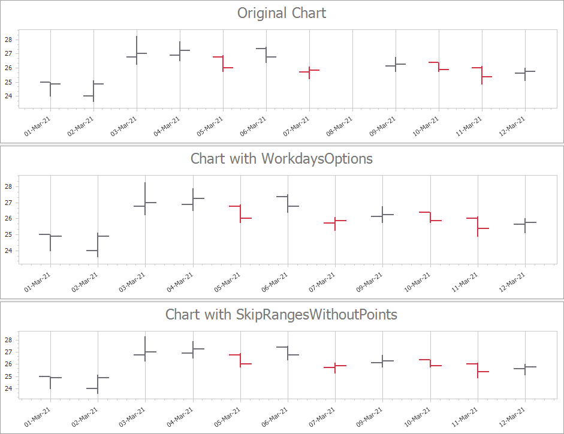

<!-- default badges list -->

<!-- default badges end -->
<!-- default file list -->
*Files to look at*:

* [Form1.cs](./CS/WeekendsExclusion/Form1.cs) (VB: [Form1.vb](./VB/WeekendsExclusion/Form1.vb))
<!-- default file list end -->
# Charts - How to exclude weekends and holidays from the axis range

This example demonstrates how you can exclude weekends and holidays from the X-axis range. This feature is useful for financial charting.

You can specify a custom week, or import holiday lists in Microsoft Outlook or in our native [XtraScheduler](https://docs.devexpress.com/WindowsForms/1729/controls-and-libraries/scheduler/visual-elements/scheduler-control) format.

The first chart excludes holidays and non-working days from the axis scale and shows how to set custom workdays and holidays. In this example, Sunday is a work day and Saturday is a day off, March 6th (Saturday) is an additional work day and March 8th (Monday) is an additional holiday. For this, use the [DateTimeScaleOptions.WorkdaysOnly](https://docs.devexpress.com/CoreLibraries/DevExpress.XtraCharts.DateTimeScaleOptions.WorkdaysOnly) and [DateTimeScaleOptions.WorkdaysOptions](https://docs.devexpress.com/CoreLibraries/DevExpress.XtraCharts.DateTimeScaleOptions.WorkdaysOptions) properties. 

The second chart shows how to exclude axis ranges without data points. In this example, March 8th has no data points to display and is not displayed on the X-axis. To do this, use the [DateTimeScaleOptions.SkipRangesWithoutPoints](https://docs.devexpress.com/CoreLibraries/DevExpress.XtraCharts.DateTimeScaleOptions.SkipRangesWithoutPoints) property.

## Documentation

- [Work Time and Workday Configuration](https://docs.devexpress.com/WindowsForms/16474/controls-and-libraries/chart-control/data-representation/work-time-and-workday-configuration)
- [Financial Charting](https://docs.devexpress.com/WindowsForms/8946/controls-and-libraries/chart-control/data-representation/financial-charting)
